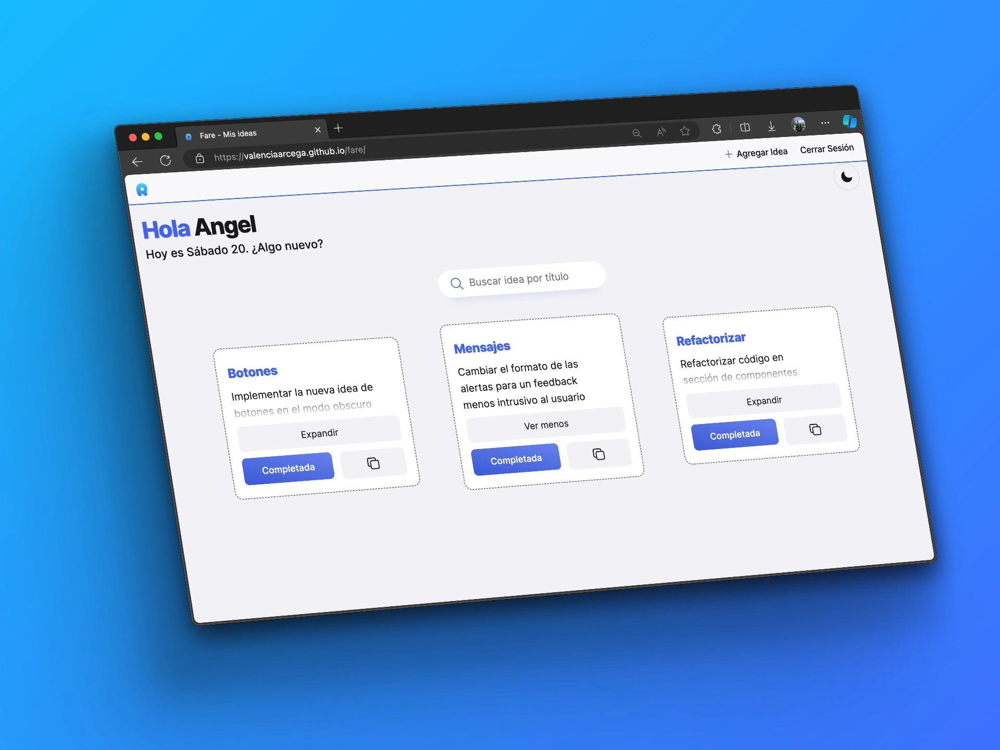
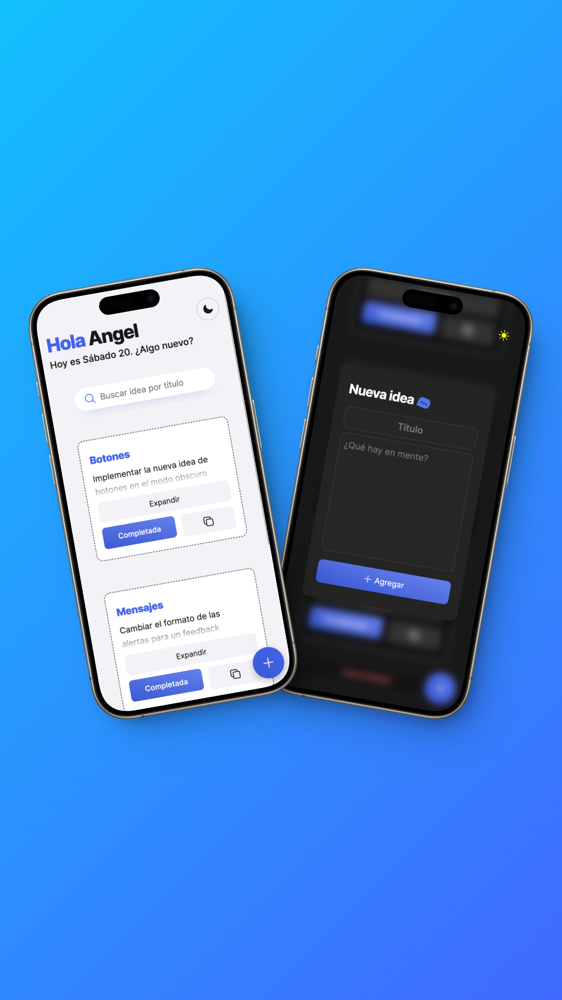
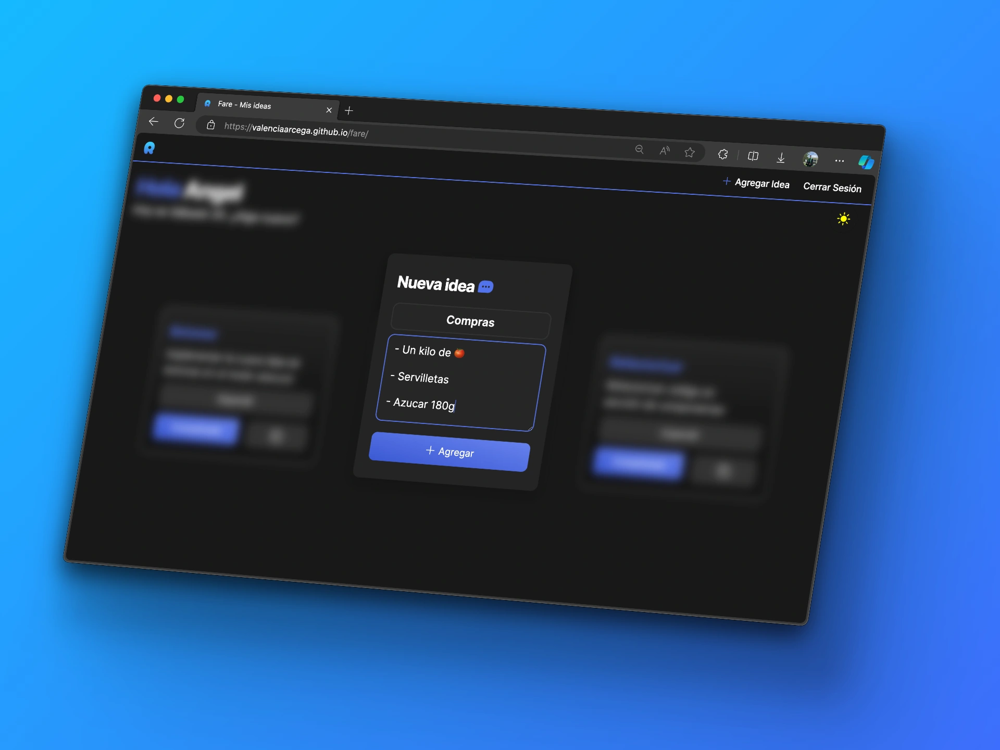

# Fare

> 💡 _¡ Que las ideas no escapen !_

_Idea_ ó _quehacer_ (**Fare** en italiano). Podrás guardar esas pequeñas o grandes tareas en un sólo lugar. Un espacio perfecto para que las ocurrencias se mantengan en el tiempo y las visites **cuando quieras**.

Fare es una herramienta web que te permite almacenar `tus ideas`, desde las más pequeñas hasta las más detalladas, todo en un espacio unico y rápido donde...

- **Sesiones**. Solo tu, eres el autor intelectual de tu mente
- **Instantánea**. Captura y revisa tus ideas al momento de pensarlas
- **No pierdas nada**. Busca entre tu mente con indexado de alta velocidad.

	

 

	
Pruebala en cualquier dispositivo

	

 

	
Las ideas viven en la obscuridad 🌙

	

